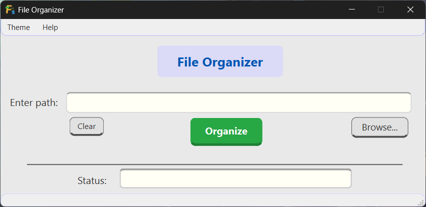
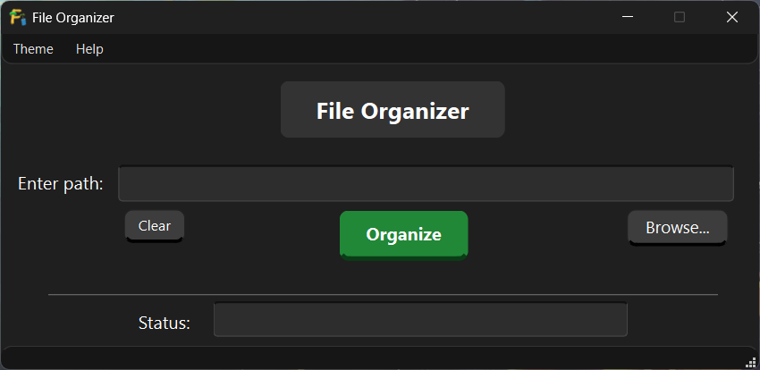
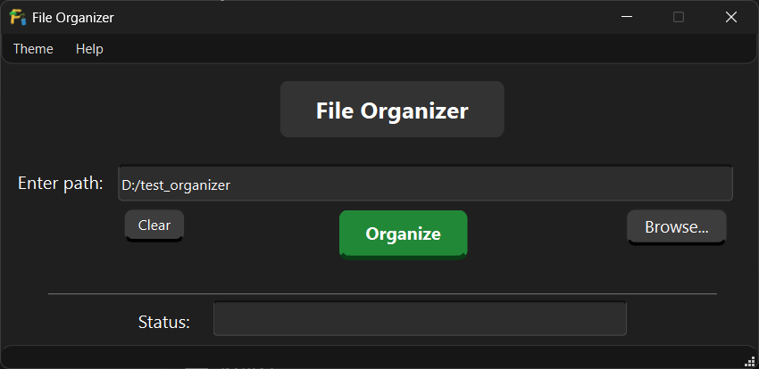
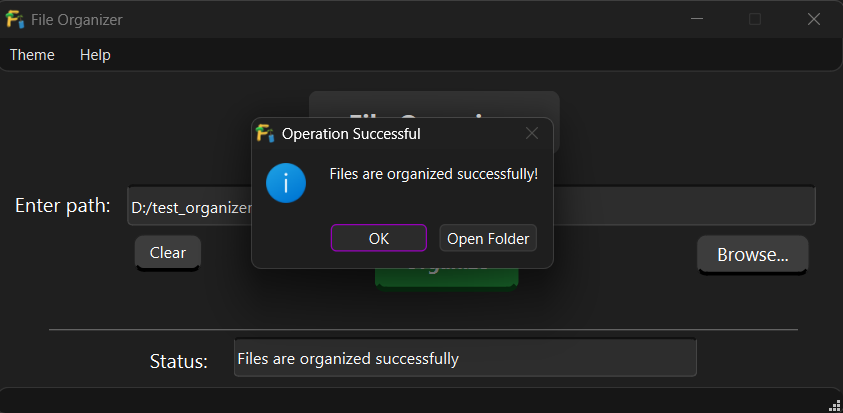

# File Organizer (C++23 & Qt6)

**A high-performance, safe, and intelligent directory cleaner built with modern C++.**


## 📖 Overview

**File Organizer** is a desktop application designed to declutter messy directories instantly. Unlike simple scripts that just move files, this application intelligently manages your filesystem by normalizing folder names, preventing data loss, and handling cross-device transfers safely.

It was built to demonstrate the power of **Modern C++ (std::filesystem)** combined with the **Qt6** framework for a responsive, non-blocking GUI.

---

## 📸 Screenshots

### Main Interface
<p align="center">
  
</p>

<p align="center">
  
</p>

### Organizing in Progress
<p align="center">
  
</p>

### Success Dialog
<p align="center">
  
</p>

---

## 🚀 Demo

### Before Organizing
<p align="center">
  
</p>

### Organizing Process
<p align="center">
  
</p>

### Final Result
<p align="center">
  
</p>

---

## ✨ Key Features

### 🧠 Smart Classification
- **Extensive Format Support:** Recognizes hundreds of extensions including Images, Videos, Documents, Audio, Archives, and Executables.
- **Developer Ready:** Specialized support for programming files (C++, Rust, Go, Python, TypeScript, etc.).
- **O(1) Lookup:** Uses optimized hash maps for instant file categorization.

### 📂 Intelligent Folder Normalization (Non-Destructive)

The organizer normalizes directories **without overriding user intent**.

- **Single Canonical Folder:**  
  Each category (e.g. Images) has one canonical folder such as **"Image Files"**.

- **Alias-Aware, Not Destructive:**  
  If folders like `pics`, `photos`, or `images` exist:
  - Only **one suitable alias** may be normalized to the canonical name.
  - Remaining alias folders are **preserved exactly as the user created them**.

- **Safe Cleaning Inside Aliases:**  
  Alias folders are treated as valid category folders:
  - Incorrect files are moved out to their proper category
  - Correct files remain untouched
  - Folder names are **never changed**
  - No merging occurs

> This design respects personal organization styles  
> (e.g. *vacation pics*, *work images*, *camera roll*) while still cleaning misplaced files.


### 🛡️ Safety & Reliability
- **Atomic Operations:** Uses `std::filesystem::rename` for instant, safe moves.
- **Collision Handling:** Never overwrites files. If `photo.jpg` exists, the new file becomes `photo(1).jpg`.
- **Cross-Device Fallback:** Automatically detects if files are on different drives and switches to a safe "Copy + Delete" mode with user permission.
- **Stack-Safe Iteration:** Uses an iterative stack approach instead of recursion, making it safe for deeply nested directory trees.
- **Non-Destructive by Design:** The organizer never mass-renames or merges folders. User-defined directory structures are always respected.
- **Selective Deep Cleaning:** Files placed inside the wrong category folder are safely relocated, while valid files and user-defined folder structures remain intact.


### ⚡ Performance
- **Asynchronous Processing:** Powered by `QtConcurrent`, the GUI remains fully responsive while organizing gigabytes of data in the background.

---

## 🛠️ Technical Stack

- **Language:** C++23
- **GUI Framework:** Qt 6 (Widgets)
- **Concurrency:** QtConcurrent / QFutureWatcher
- **Filesystem:** std::filesystem
- **Build System:** qmake

---

## 🚀 Getting Started

### Prerequisites
* C++ Compiler supporting C++23 (GCC 13+, Clang 16+, MSVC 2022)
* Qt 6 SDK installed (with qmake)
* Qt Creator

### Building from Source

1.  **Clone the repository:**
    ```bash
    git clone https://github.com/coder-yaan/FileOrganizer.git
    cd FileOrganizer
    ```

2.  **Open the project:**
    - Open `File_Organizer.pro` in **Qt Creator**

3.  **Configure:**
    - Select a Qt 6 Kit (MinGW or MSVC)

4.  **Build & Run**

---

## 📸 Usage

1.  **Select Directory:** Click "Browse" to choose the folder you want to clean.
2.  **Organize:** Click the "Organize" button.
3.  **Monitor:** Watch the progress bar (or status text).
4.  **Complete:** Once finished, a popup will confirm success and offer to open the folder for you.

*Note: You can switch between **Light** and **Dark** themes via the "View" menu.*

---

## 📂 Project Structure

- **`extensions.hpp/cpp`**: The "Brain". Contains the knowledge base of file extensions and categorization logic.
- **`filesystem_utils.hpp/cpp`**: The "Hands". Handles low-level filesystem operations, safety checks, and unique naming.
- **`organizer.hpp/cpp`**: The "Manager". Orchestrates the traversal logic and decides where files go.
- **`mainwindow.h/cpp`**: The "Face". Handles the Qt GUI, threading, and user interaction.

---

## 🤝 Contributing

Contributions are welcome! Please open an issue or submit a pull request if you have ideas for new file categories or UI improvements.

## ⚖️ License & Copyright

**Source Code:**
The source code is licensed under the MIT License. See `LICENSE` for details.

**Assets:**
The application name, logo, and icon are **not covered by the MIT License**.
The Application name, Logo/Icon is Copyright © Ayan 2026. **All Rights Reserved.**
You may not use, modify, or redistribute the logo without explicit permission.